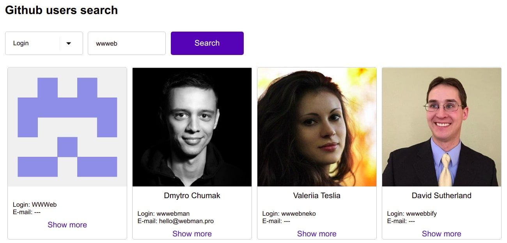

# React user search task

| Core Technology | Сomplexity | Estimation | Goal |
| --------------- | ---------- | ---------- | ---- |
| [React](https://reactjs.org/) | Medium | 4-12 hours | Check if a candidate can write reusable components, use best practices, work with asynchronous code using third-party API. |

- If you are a **recruiter**, and the task doesn't fit the recruiting process ask your Tech Lead to modify the stack
- If you are a **candidate**, don't copy/paste if you found a solution on the Internet. A technical person can catch you sooner or later. 
  For both sides, it is time-wasting if you won't implement this by yourself.

## Task

Develop a simple **React application** that allows **searching Github users** by login, name, or email.

### Starters

Use one of the following starters:

- [Next.js](https://github.com/zeit/next.js#quick-start)
- [Create React App](https://github.com/facebook/create-react-app)
- [Gatsby.js](https://www.gatsbyjs.com/docs/quick-start)
- [Other](https://blog.bitsrc.io/11-react-application-boilerplates-for-2019-b49a8226ea54)

### Components

Implement the following components:

- `<Select placeholderText="Search by" />`
- `<Input placeholderText={selectedOption} />`
- `<SubmitButton />`
- `<UsersList />`
- `<UserProfileCard />`
- `<Validation />`, `useValidation` hook or utils (implement custom or native validation)

_Please write your own components instead of using components from material-ui, antd, etc._

### User path

1. A user chooses "Search by" option using `<Select />` component ("Login", "Name", "Email"):
1. A user provides a value to the `<Input />` component, and the following validation occurs:
   - "Search by" :point_right: "Name":
     - Required
     - Minimum 3 characters
   - "Search by" :point_right: "Login":
     - Required
     - Minimum 3 characters
   - "Search by" :point_right: "Email":
     - Required
     - Accepts only valid email format
1. A user clicks `<SubmitButton />`
1. A user gets `<UserProfileCard />` with profile information or _"No users found."_ message.

### Required

1. Use React.js
1. Use any other libraries that can help you to implement the task
1. [RWD](https://en.wikipedia.org/wiki/Responsive_web_design)
1. Publish the task to your own Github account
1. Add a `README.md` file with instruction about installation and how to run the app

### Important!

- You can use any other API instead of [Github](#github-api) if you think you can be more performant with it
- Use any technology stack around your React application
  - State management:
    - [Apollo](https://www.apollographql.com/docs/react/)
    - [React context](https://reactjs.org/docs/context.html)
    - [Recoil.js](https://recoiljs.org/)
    - [Mobx](https://mobx.js.org/README.html)
    - [Redux](https://redux.js.org/)
    - [Xstate](https://github.com/davidkpiano/xstate)
  - Styling:
    - [JSS](https://cssinjs.org/react-jss/)
    - [Sass](https://sass-lang.com/)
    - [Styled-components](https://styled-components.com/)
    - [Tailwind](https://tailwindcss.com/)
  - Testing:
    - [Enzyme](https://enzymejs.github.io/enzyme/docs/api/)
    - [Jest](https://jestjs.io/)
    - [React Testing Library](https://testing-library.com/docs/react-testing-library/intro/)

### Additional points

Don't try to implement all these features and spend too much time on it.

- Adding "Load more" functionality
- Adding a profile page of particular user
- Adding unit tests
- Clean GIT commits history
- UI/UX skills
- Using Eslint
- Using Prettier
- Using Typescript
- Using best practices (DRY, KISS, SOLID, etc.)

### Design example

The following design is the only example that would give you a visual understanding of what is required by the task.
It would be great if can make it look even better than in the following example:

<details>
<summary>Show design</summary>



</details>

### Github API

#### GitHub GraphQL API

Here are some details if you decide to use Github Graphql API:

- [Documentation](https://developer.github.com/v4/)
- [Explorer](https://developer.github.com/v4/explorer/)

**Queries:**

```
query SearchUsers($query: String!, $first: Int!) {
  search(query: $query, type: USER, first: $first) {
    edges {
      node {
        ... on User {
          login
        }
      }
    }
  }
}

query GetUser($login: String!) {
  user(login: $login) {
    name
    bio
    websiteUrl
  }
}
```

**Variables:**

```json
{
  "query": "Dan Abramov",
  "first": 10,
  "login": "gaearon"
}
```

#### GitHub REST API

The [documentation](https://docs.github.com/en/free-pro-team@latest/rest/reference/users).
